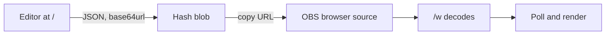
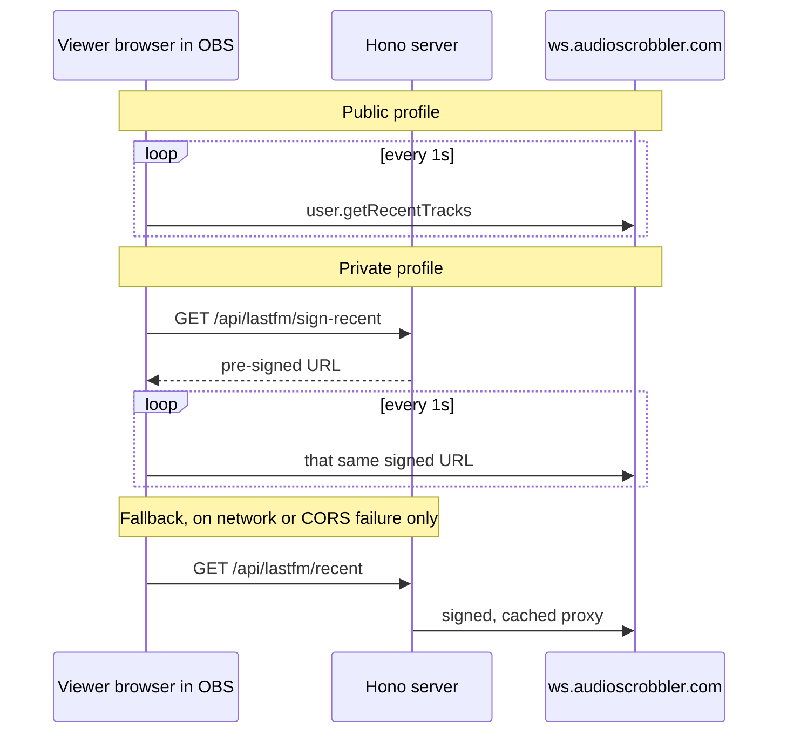
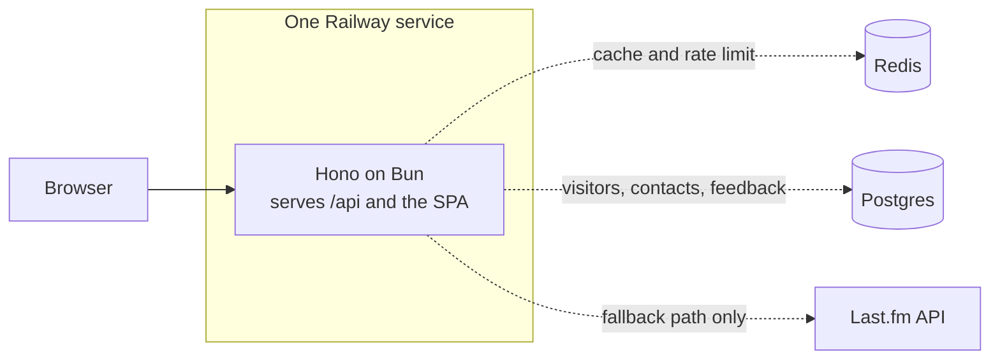

# Music Widget

[](https://github.com/oyuh/music-widget/actions/workflows/ci.yml)


[](LICENSE)

A Last.fm now-playing overlay for OBS, Streamlabs, and XSplit. You lay it out in a drag-and-drop editor, the editor hands you a URL, you paste that URL into a browser source. The whole design lives in the URL, so there are no accounts and nothing is stored server-side.

Under the hood: a Bun workspace holding a SvelteKit editor and widget SPA, a Hono API, and a Redis + Postgres dev stack.

- Live app: [fast.jamlog.lol](https://fast.jamlog.lol)
- User docs: [the wiki](https://github.com/oyuh/music-widget/wiki), source in [`wiki/`](wiki/)

## Contents

- [How it works](#how-it-works)
  - [The widget URL](#the-widget-url)
  - [Layout engines](#layout-engines)
  - [Element instances](#element-instances)
  - [Custom CSS](#custom-css)
  - [Polling and progress](#polling-and-progress)
  - [Why Last.fm calls skip the server](#why-lastfm-calls-skip-the-server)
- [Repository layout](#repository-layout)
- [Architecture](#architecture)
- [Local development](#local-development)
- [Environment variables](#environment-variables)
- [Common commands](#common-commands)
- [API endpoints](#api-endpoints)
- [Deployment](#deployment)
- [Operational notes](#operational-notes)
- [Known constraints](#known-constraints)
- [Contributing](#contributing)
- [License](#license)

## How it works

The editor at `/` is a canvas. You place elements, style them, and copy out a URL that encodes everything you did.



Eight element kinds are available: `background`, `art`, `title`, `artist`, `album`, `progress`, `duration`, and `pause`. Each carries its own position, size, color, outline, shadow, and per-track-change animation, and text elements add typography. The editor autosaves to `localStorage` on every change.

### The widget URL

The config is JSON, base64url-encoded, and dropped in the URL hash:

```text
https://fast.jamlog.lol/w#eyJ2ZXJzaW9uIjoyLCJ1c2VyIjoib3l1aCIsInYyIjp7Li4ufX0
```

The hash never reaches the server. `/w` decodes it on load, listens for `hashchange`, and re-renders when you edit the URL by hand. See `encodeConfig` and `decodeConfig` in [`config.ts`](apps/web/src/lib/config.ts).

### Layout engines

The `version` field picks the renderer:

- `version: 1`: a fixed grid, rendered by [`WidgetLegacy.svelte`](apps/web/src/lib/WidgetLegacy.svelte).
- `version: 2`: free positioning, where every element gets `x/y/w/h`, a z-index, and optional snap relationships. Rendered by [`WidgetV2.svelte`](apps/web/src/lib/WidgetV2.svelte).

`migrateToV2` upgrades old grid designs on decode, so old v1 URLs still open.

### Element instances

Elements are keyed by instance id, not by kind. The first instance of a kind uses the bare name and extras take a suffix, up to `MAX_PER_KIND` (3):

```text
background, background#2, background#3, art, art#2, title, title#2, …
```

The bare name is deliberate: designs saved before instances existed decode unchanged, and `[data-el="title"]` in someone's custom CSS still points at the same box.

Two settings stay widget-wide rather than per-instance, the album-art failure reflow (`reflowArtGone`) and the fallback-image URL. Extra art instances render the same cover.

Ids come from a hand-editable hash, so `mergeConfig` validates each through `isValidElementId`, drops unknown kinds and over-cap instances, and nulls snaps pointing at whatever it dropped.

### Custom CSS

An experimental panel takes raw CSS. `scopeCss` strips `@import` and nests the sheet under `.mw-widget`, so it can never reach the editor UI around it. Budget is 4000 characters, since this rides in the URL too. `experimental.enabled: false` keeps the CSS but stops applying it. Selectors are listed in [the wiki](https://github.com/oyuh/music-widget/wiki/Custom-CSS).

### Polling and progress

Last.fm has no push API, so the widget polls `user.getRecentTracks` and watches the `nowplaying` flag.

| Tab state | Interval |
|-----------|----------|
| Visible, playing | 1000 ms |
| Visible, stopped | 1000 ms |
| Hidden | 5000 ms |

Each viewer polls from their own IP, so playback state does not change the cadence. OBS sources always report as visible, which holds overlays at 1000 ms and catches track changes within about a second. Consecutive errors back off 1.5x, capped at 10 seconds. Between polls the progress bar ticks off the reported duration, with pause detection and a resume estimate. See [`nowplaying.svelte.ts`](apps/web/src/lib/nowplaying.svelte.ts).

### Why Last.fm calls skip the server

Last.fm rate-limits at roughly 5 requests per second per IP. Proxying every viewer would pool them all onto the server's one IP, so one streamer going live with a real audience would throttle everyone at once.

Instead each browser calls `ws.audioscrobbler.com` itself and spends its own budget. Album art and color extraction load from Last.fm's CDN the same way, since it sends `Access-Control-Allow-Origin: *`.



Private profiles need a signed call, and signing needs the shared secret, which stays on the server. Last.fm signatures carry no timestamp or nonce, so the server signs the URL once and the browser reuses it for every poll. The proxy routes in [`lastfm.ts`](apps/server/src/lastfm.ts) are the fallback.

## Repository layout

```text
.
├── apps/
│   ├── web/                # SvelteKit SPA: editor (/), widget (/w), callback, legal pages
│   └── server/             # Bun + Hono API; serves the built SPA, talks to Redis + Postgres
├── scripts/                # cron cleanup, preset generation
├── tests/                  # unit tests
├── wiki/                   # source for the GitHub wiki
├── docker-compose.dev.yml  # local Redis + Postgres
├── Dockerfile              # production image: builds the SPA, starts Hono
├── railway.json            # Railway deployment config
├── drizzle.config.ts       # Drizzle Kit migration config
└── package.json            # Bun workspace scripts
```

## Architecture

One container serves both halves. Redis and Postgres are optional and fail open.



### Web app: `apps/web`

A SvelteKit SPA on `adapter-static` (client-side rendering only), Svelte 5 runes, Tailwind v4. It owns the editor, the config encoding, browser-direct polling, widget rendering, and the Last.fm auth callback.

| File | Does |
|------|------|
| [`config.ts`](apps/web/src/lib/config.ts) | Config schema, encode/decode, v1 to v2 migration, CSS scoping |
| [`config-merge.ts`](apps/web/src/lib/config-merge.ts) | Validates and merges a decoded hash against defaults |
| [`editor.svelte.ts`](apps/web/src/lib/editor.svelte.ts) | Editor state |
| [`nowplaying.svelte.ts`](apps/web/src/lib/nowplaying.svelte.ts) | Polling, pause detection, progress |
| [`lastfm-client.ts`](apps/web/src/lib/lastfm-client.ts) | Browser-direct Last.fm client |
| [`WidgetV2.svelte`](apps/web/src/lib/WidgetV2.svelte) | Current renderer |
| [`WidgetLegacy.svelte`](apps/web/src/lib/WidgetLegacy.svelte) | v1 grid renderer |

### Server app: `apps/server`

A Hono service on Bun. In production it serves the static build and the API on one port; in dev, Vite serves the UI and proxies `/api` to it. Redis (`Bun.redis`) caches the proxied Last.fm paths and backs rate limiting. Postgres (Drizzle on `drizzle-orm/bun-sql`) stores the visitor log, contacts, and feedback.

| File | Does |
|------|------|
| [`index.ts`](apps/server/src/index.ts) | Routing, static serving, `robots.txt`, `sitemap.xml` |
| [`lastfm.ts`](apps/server/src/lastfm.ts) | Signing, proxy, session exchange |
| [`security.ts`](apps/server/src/security.ts) | Rate limiting, image-proxy allowlist |
| [`schema.ts`](apps/server/src/schema.ts) | Drizzle tables: visitors, contacts, feedback |
| [`stats.ts`](apps/server/src/stats.ts) | Background user count, refreshed every 7 minutes |
| [`github.ts`](apps/server/src/github.ts) | Background star count, refreshed every 15 minutes |

Both background counters hold their value in memory and keep the last good number on failure, so the public routes never touch Postgres or GitHub per request.

## Local development

You need Bun 1.3 or newer. Docker is optional; without it you lose caching, rate limiting, and logging, and nothing else changes.

```bash
bun install
bun run services:up   # Redis + Postgres in Docker, optional
bun run dev           # Vite UI on :5173, Hono API on :8787
```

Open `http://localhost:5173`. Copy [`.env.example`](.env.example) into `.env` for server values and `.env.local` for the `VITE_*` ones. Real data needs a key and secret from [the Last.fm API account page](https://www.last.fm/api/account/create).

## Environment variables

Vite reads the repo root as its env directory, so both files live there.

| Variable | Side | Purpose |
|----------|------|---------|
| `LFM_API_KEY` / `LFM_SHARED_SECRET` | server | Last.fm credentials; the secret signs private and proxied calls |
| `REDIS_URL` | server | Cache and rate-limit store. Unset means neither runs |
| `DATABASE_URL` | server | Postgres for visitors, contacts, feedback. Unset means off |
| `CRON_SECRET` | server | Bearer token guarding `POST /api/cron/cleanup`. Unset means the route 503s |
| `PORT` / `LOG_LEVEL` | server | Bind port, log verbosity |
| `WEB_DIR` | server | Override the built-SPA directory. Defaults to the path the Dockerfile builds to |
| `GITHUB_REPO` / `GITHUB_TOKEN` | server | Star-count source and optional token. Defaults to `oyuh/music-widget`, unauthenticated |
| `VITE_LFM_KEY` | web, build time | Public Last.fm key for browser-direct calls |
| `VITE_LFM_CALLBACK` | web, build time | Last.fm auth callback URL |

## Common commands

Run these from the repository root.

| Command | Purpose |
|---------|---------|
| `bun run dev` | Vite UI and Hono API together |
| `bun run build` | Build the SvelteKit SPA |
| `bun run typecheck` | Typecheck both workspaces |
| `bun test` | Unit tests |
| `bun run services:up` / `services:down` | Local Redis + Postgres |
| `bun run db:generate` | Generate Drizzle migrations from the schema |
| `bun run db:migrate` | Apply migrations |
| `bun run cron:cleanup` | Run visitor-log housekeeping by hand |

Dependency updates skip workspaces from the root, so run `bun update` inside `apps/server` and `apps/web`.

## API endpoints

Everything lives under `/api`. The Last.fm proxy routes exist as the fallback; the normal path, public and private alike, never touches them.

| Endpoint | Purpose |
|----------|---------|
| `GET /api/ping` | Liveness. Always 200 while the process is up |
| `GET /api/health` | Redis status, plus informational Postgres status. 503 if Redis is configured but down |
| `GET /api/usage` | The caller's own rate-limit counter. Reads without incrementing, exempt from the limiter |
| `GET /api/lastfm/recent`, `/trackInfo` | Signed and cached proxy, used when a direct call fails |
| `GET /api/lastfm/sign-recent` | Signs a private-profile recent-tracks URL once |
| `POST /api/lastfm/session` | Exchange an auth token for a session key |
| `GET /api/proxy-image` | Album-art fetch fallback, host-allowlisted |
| `POST /api/log/widget` | Visitor log, one row per visitor, fire-and-forget |
| `POST /api/contact` | Store a contact email against a Last.fm username |
| `POST /api/feedback` | Store a feedback submission, append-only |
| `POST /api/cron/cleanup` | Visitor-log dedupe and prune. Needs `CRON_SECRET` |
| `GET /api/site-stats` | Cached distinct-user count for the editor |
| `GET /api/github-stars` | Cached star count for the footer |
| `GET /robots.txt`, `/sitemap.xml` | Crawler files, generated per request origin |

## Deployment

The `Dockerfile` builds the SPA and starts Hono, which serves both.

1. Point Railway at the repo and add the Redis and Postgres plugins.
2. Set `LFM_API_KEY`, `LFM_SHARED_SECRET`, `REDIS_URL=${{Redis.REDIS_URL}}`, `DATABASE_URL=${{Postgres.DATABASE_URL}}`, plus build-time `VITE_LFM_KEY` and `VITE_LFM_CALLBACK=https://your-domain/callback`.
3. Deploy. Migrations run on the server's first write, so there is no manual step.

After editing [`schema.ts`](apps/server/src/schema.ts), run `bun run db:generate` and commit the file under `apps/server/drizzle/`. To apply by hand, point `DATABASE_URL` at the target and run `bun run db:migrate`.

## Operational notes

| Concern | Behavior |
|---------|----------|
| Proxy cache | Recent tracks 1s, track info 24h |
| Rate limit | 60 requests per 10s per IP. Normal polling goes to Last.fm, not here, so only abusive bursts trip it. Fails open when Redis is down |
| Image proxy | Allowlisted to Last.fm, Spotify, Apple, YouTube, Instagram, and Pinterest CDNs, so it cannot become an SSRF proxy |
| Redis down | No cache, no rate limiting, widget keeps serving |
| Postgres down | No visitor log, contacts, or feedback; the user count hides itself |

## Known constraints

- The design lives in the URL hash. No accounts, no server-side saves. Lose the URL and the design goes with it, though the editor keeps a `localStorage` autosave as a net.
- Last.fm has no event stream, so now-playing runs about a second behind reality.
- Browser-direct calls expose the Last.fm API key in DevTools, since it is a query param on every request. Any client-side app using this API has the same property. The key is not a credential, the shared secret is, and the secret stays on the server.

## Contributing

Contributions are welcome and credited. See [CONTRIBUTING.md](CONTRIBUTING.md) for setup, the checks to run before opening a PR, and licensing.

## License

Source-available for personal use, self-hosting and streaming with it included. Redistribution and commercial use need permission. Full terms in [LICENSE](LICENSE).

Questions or redistribution requests: [me@lawsonhart.me](mailto:me@lawsonhart.me).
